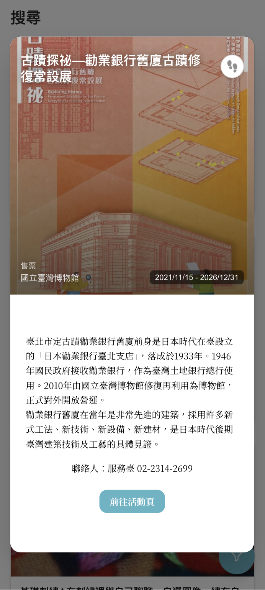
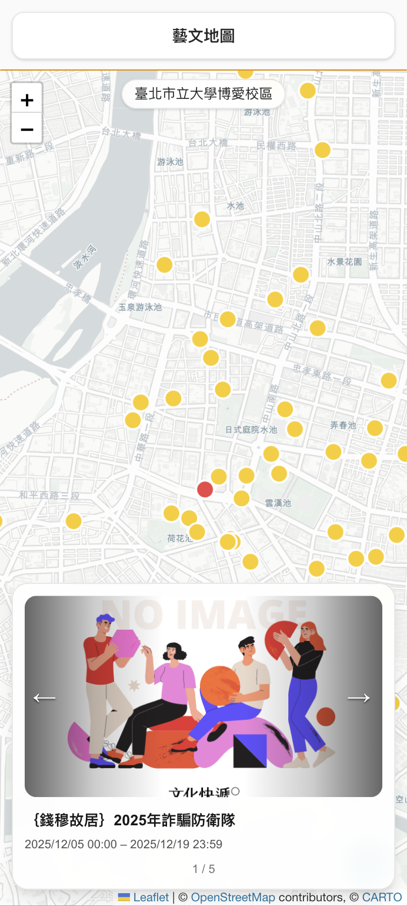
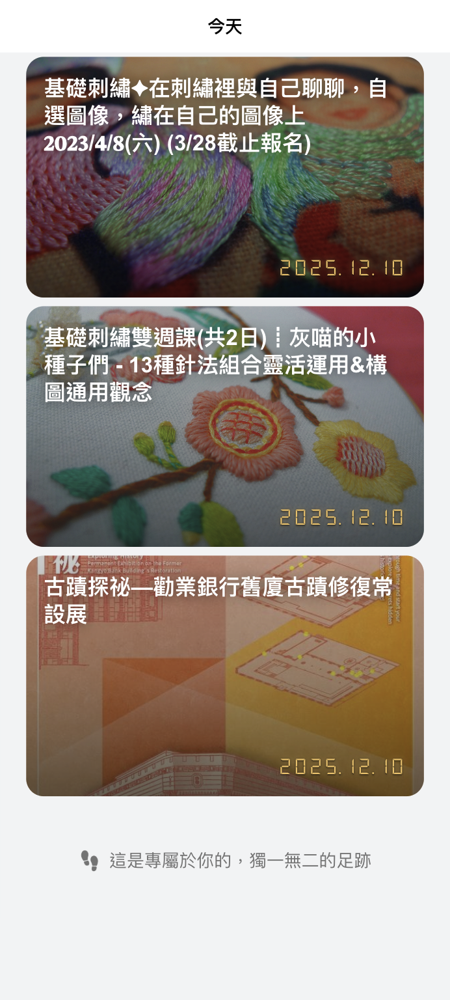
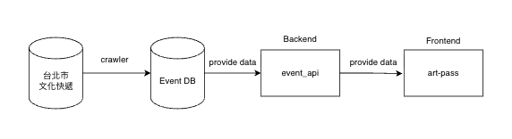

# 藝文足跡 (Art Pass)

## 一、一般參賽者必填項目（README）

### 1. 專案簡介 / Project Overview

#### 專案目的與想解決的問題
藝文足跡旨在解決台北市民「不知道有哪些藝文活動可以參加」的痛點。許多精彩的展覽、音樂會、劇場演出因為資訊分散，導致民眾錯過參與機會。本專案整合台北市文化快遞開放資料，提供直覺的搜尋、地圖探索、以及個人化的觀展記錄功能，讓藝文愛好者能輕鬆發現身邊的展演活動，並打造專屬的藝文生活時間軸。

#### 核心功能摘要
提供熱門展演推薦與智能篩選功能，結合互動式地圖顯示附近場館資訊，並透過藝術護照記錄個人觀展足跡，打造專屬藝文歷程時間軸。

#### Demo Screenshot / GIF

| 首頁 | 搜尋篩選 |
|:---:|:---:|
|  |  |
| *熱門展演輪播與快速導航* | *依類別、票價、時間快速篩選* |

| 地圖探索 | 藝術護照 |
|:---:|:---:|
|  |  |
| *場館位置與附近展演* | *個人觀展足跡時間軸* |

---

### 2. 系統架構 / System Architecture

#### 架構圖
<!-- TODO: 請插入系統架構圖 -->


```
┌─────────────────────────────────────────────────────────────────────┐
│                         使用者 (Browser)                             │
└─────────────────────────────────────────────────────────────────────┘
                                   │
                                   ▼
┌─────────────────────────────────────────────────────────────────────┐
│                    TownPass App (Flutter)                           │
│                    藝文足跡入口 (WebView)                             │
└─────────────────────────────────────────────────────────────────────┘
                                   │
                                   ▼
┌─────────────────────────────────────────────────────────────────────┐
│               art-pass 前端 (Next.js 16 / React 19)                 │
│                       http://localhost:3000                         │
│  ┌─────────┐  ┌─────────┐  ┌─────────┐  ┌─────────┐                │
│  │  首頁   │  │  搜尋   │  │  地圖   │  │  護照   │                │
│  └─────────┘  └─────────┘  └─────────┘  └─────────┘                │
└─────────────────────────────────────────────────────────────────────┘
                                   │
                                   ▼
┌─────────────────────────────────────────────────────────────────────┐
│               event_api 後端 (FastAPI / Python)                     │
│                       http://localhost:8000                         │
│  ┌─────────────────┐  ┌─────────────────┐  ┌─────────────────┐     │
│  │  活動查詢 API   │  │  使用者護照 API  │  │  圖片代理服務   │     │
│  └─────────────────┘  └─────────────────┘  └─────────────────┘     │
└─────────────────────────────────────────────────────────────────────┘
                                   │
                                   ▼
┌─────────────────────────────────────────────────────────────────────┐
│                         資料來源                                     │
│  ┌─────────────────────────┐  ┌─────────────────────────┐          │
│  │  台北市文化快遞開放資料  │  │  使用者資料 (JSON)       │          │
│  │  (events.json)          │  │  (userdata.json)        │          │
│  └─────────────────────────┘  └─────────────────────────┘          │
└─────────────────────────────────────────────────────────────────────┘
```

#### 使用到的主要技術堆疊（Tech Stack）

| 類別 | 使用技術/版本 | 備註 |
|------|--------------|------|
| 前端框架 | Next.js 16 (App Router) | 採用 App Router 架構，支援 Server Components |
| UI 框架 | React 19.2.0 + TypeScript | 使用 Tailwind CSS 4 進行樣式設計 |
| 行動應用 | Flutter 3.3+ | TownPass 市民卡 App，透過 WebView 嵌入藝文足跡 |
| 後端框架 | FastAPI (Python 3.8+) | 輕量 Web API 框架，負責活動資料管理與使用者資料儲存 |
| 資料儲存 | JSON 檔案 (orjson 加速) | 輕量化資料儲存：events.json、userdata.json |
| 外部 API | 台北市文化快遞開放資料 | JSON 格式，用於取得展演活動資訊 |
| 地圖服務 | Leaflet.js 1.9.4 + OpenStreetMap | 開源互動式地圖庫（無需 API Key） |

---

### 3. 安裝與執行方式 / Installation & Run

#### 本地端執行方式

執行本專案前，請確認您的環境已安裝以下必要組件：

- **Node.js**: v18.0 或以上
- **Python**: v3.8 或以上
- **Flutter**: v3.3 或以上（若需執行 TownPass App）

#### 步驟說明：

**1. 複製專案庫**
```bash
git clone https://github.com/your-repo/townpass-art-pass.git
cd townpass-art-pass
```

**2. 安裝並啟動後端 API**
```bash
cd event_api

# 建立虛擬環境
python -m venv .venv
source .venv/bin/activate  # Windows: .venv\Scripts\activate

# 安裝依賴套件
pip install -r requirements.txt

# 複製環境變數範本
cp .env.example .env

# 啟動服務 (Port 8000)
uvicorn app.main:app --host 0.0.0.0 --port 8000 --reload
```

**3. 安裝並啟動前端應用**
```bash
cd art-pass

# 安裝依賴套件
npm install

# 複製環境變數範本
cp .env.example .env

# 啟動服務 (Port 3000)
npm run dev
```

**4. 開啟瀏覽器**
訪問 [http://localhost:3000](http://localhost:3000)

#### 需要設定的環境參數（.env example）

**前端 (art-pass/.env)**：
```env
# API 後端位址
NEXT_PUBLIC_API_BASE=http://localhost:8000
```

**後端 (event_api/.env)**：
```env
# 資料檔案路徑
EVENTS_JSON_PATH=./output/events.json
USERDATA_JSON_PATH=./output/userdata.json
IMAGES_DIR_PATH=./output/images

# API 設定
API_BASE_URL=http://localhost:8000
MAX_LIMIT=500
DEFAULT_RANDOM_AMOUNT=5
DEFAULT_RECENT_AMOUNT=5
DEFAULT_FILTER_LIMIT=0

# CORS 設定
ENABLE_CORS=true
```

**TownPass Flutter (TownPass/.env)**：
```env
# Art Pass 藝文足跡 URL
ART_PACE_URL=https://art-pass-seven.vercel.app/
```

#### Docker 執行方式（若有）
> ⚠️ Docker 配置尚未提供，規劃於未來版本加入。

---

### 4. 功能說明 / Features

| 功能編號 | 功能名稱 | 簡述 | 資料來源描述 |
|---------|---------|------|-------------|
| 4.1 | 熱門展演推薦 | 首頁輪播展示精選藝文活動，支援自動播放、手勢滑動與圓點導航 | 台北市文化快遞開放資料，JSON 格式，每日更新 |
| 4.2 | 智能搜尋篩選 | 依類別（音樂現場、展覽、戲劇等）、票價（免費/售票/索票）、時間範圍（今日/本週/近30日）快速篩選活動 | 台北市文化快遞，前端本地計算與篩選 |
| 4.3 | 藝文地圖 | 基於 Leaflet.js 顯示場館位置標記，支援點擊查看展演資訊、GPS 定位 | 台北市文化快遞 + OpenStreetMap 圖資 |
| 4.4 | 藝術護照 | 記錄使用者觀展足跡，以時間軸方式呈現個人藝文歷程，支援月份分組與快速跳轉 | 後端 API 儲存（userdata.json） |
| 4.5 | TownPass 整合 | 透過 TownPass 市民卡 App WebView 嵌入，支援用戶 ID 傳遞進行個人化體驗 | TownPass App 內建 |

---

## 二、若使用 AI，需額外補充的項目（AI Usage Declaration）

### 1. 使用到的 AI 模型

- **ChatGPT**：GPT-4o
- **Gemini**：Gemini 2.5 Pro
- **Claude**：Claude Sonnet 4
- **影像生成**：未使用
- **自行架設 / 本地模型**：未使用

### 2. 使用範圍（清楚列點）

**程式碼產生**：
- 前端元件雛形：約佔總程式碼的 **40%**
  - 特定功能模組：EventCard、FilterSheet、MapView、MorphDialog 等核心元件的初始架構
  - TypeScript 型別定義與介面設計
- 後端 API 雛形：約佔總程式碼的 **30%**
  - 特定功能模組：活動資料管理、使用者資料 CRUD、篩選邏輯等

**UI/UX 設計協助**：
- Wireframe 規劃與佈局建議
- Color Scheme (配色方案) 建議（主色調：`rgb(90, 180, 197)`）
- 互動流程優化建議

**文字生成**：
- README、ARCHITECTURE.md、API_SPEC.md 等技術文件的初稿撰寫與潤飾
- 程式碼註釋與文件翻譯（中英對照）

**測試案例 / 文件生成**：
- API 測試案例設計
- 使用者情境模擬與邊緣案例分析

**資料清洗或摘要**：
- 從台北市文化快遞開放資料中快速摘要關鍵欄位
- 資料欄位對應邏輯設計與建議清洗流程

### 3. AI 產生內容如何被驗證或修改

**人工 Code Review**：所有 AI 產生的程式碼都經過至少一位組員的人工 Code Review，確保邏輯正確性與符合專案風格。

**安全性檢查**：特別針對使用者輸入驗證、API 路由權限進行安全性檢查，避免潛在的 XSS、CSRF 等安全漏洞。

**AI 產出後 Refactor**：絕大多數 AI 產出的程式碼塊被整合進現有框架時，都經過 Refactor (重構)，以提高可讀性和模組化程度，並優化效能。

**功能測試**：逐一驗證每個功能的實際運作情況，進行跨瀏覽器測試（Chrome、Safari、Firefox）確保一致性。

**引用來源 (Prompt 範例)**：
- **Prompt 範例一 (前端元件)**：「使用 React 19 和 Tailwind CSS 建立一個響應式的活動卡片組件，包含圖片、標題、日期、地點，並支援愛心收藏按鈕。」
- **Prompt 範例二 (後端 API)**：「使用 FastAPI 設計一個 RESTful API 端點，支援依類別、票價、時間範圍篩選活動資料，並實作分頁功能。」

### 4. 與 AI 相關的限制或風險

**目前模型可能產生錯誤資訊 (幻覺/Hallucination)**：在使用 AI 進行資料格式轉換或外部 API 參數查詢時，發現偶爾會產生錯誤或過時的資訊，需要人工進行雙重確認。

**自動化程式碼生成可能會遺留安全性漏洞**：儘管進行了安全性檢查，仍可能存在 AI 遺留的次要安全風險，我們已盡力在核心邏輯上進行人工審查，並遵循 OWASP 安全最佳實踐。

**資料來源與版權聲明**：AI 生成的文字內容僅用於非商業用途的專案文件。我們已確保其不會直接抄襲公開文獻。

**是否涉及敏感資料 (應避免)**：在與 AI 互動過程中，我們未曾輸入任何專案機密、使用者個人資料或未公開的 API 金鑰。

---

## 專案資訊

- **開發團隊**：4Dimo 團隊
- **開發期間**：2025/11 - 2025/12
- **前端部署**：Vercel ([art-pass-seven.vercel.app](https://art-pass-seven.vercel.app/))
- **後端部署**：自建伺服器

**最後更新**：2025/12/10
